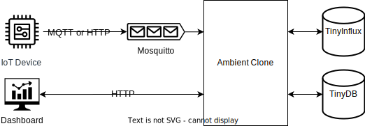

# Ambient Clone

A working [Ambient](https://ambidata.io/) clone using [TinyFlux](https://github.com/citrusvanilla/tinyflux).

[Ambient](https://ambidata.io/) is an IoT platform for data collection and visualization.

## features
- [x] User management
- [x] Push data
  * [ ] MQTT support
- [ ] Query data
- [ ] Simple Dashboard

## diagram


## run
```shell
$ poetry install --with dev
$ poetry run uvicorn ambient_clone.main:app --reload
```